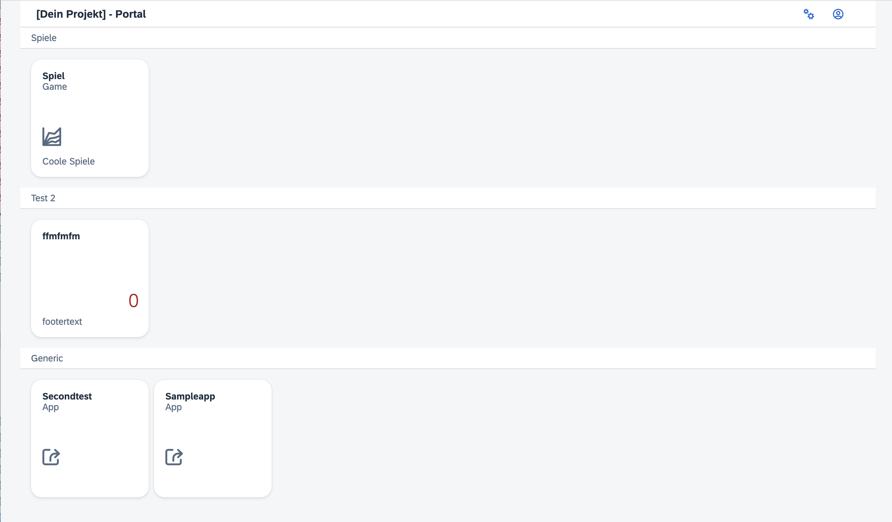

# ui5-portal
A portal / app template structure for API based open UI5 suites.
This project is using the openui5 libraries and has been jump-started by the easy-ui5 generator.

The goal for this project is to provide an easy framework for a landing page of Multi-App OpenUI5 projects that either stand alone or connect to a web-based API. 
The overview / portal page manages the display of the apps in the App-Folder. Also it is able to manage an API login (to obtain a token) and can manage settings for variables to be maintained for the apps.

## How to start
1. Clone the project into a folder on your webserver.
2. Go into the Models folder and adjust the config.json and apps.json file to your needs. I suggest to start all with a file-base to get a feeling for the functionality before integration with APIs.
3. Change the Portalname and other texts in the language files (i18n folder).
4. Copy the webapp folders of the apps you want to host into the apps folder with a name that matches the app.js links

## How To for Use Cases
### 1. Login
In the config.json there are a number of switches for managing logins. All variants require an API that provides user/password authentication and provides a bearer token.

    a. LoginPossible: true => show the icon to click on a login. This requires the Backendbase to point to your API and the Loginpath providing the path to POST the user credentials.

    b. LoginForced: true => Requires all above to be activated. This requires a login before any other activities can be performed in the portal.

### 2. Source for apps
The apps can be sourced from the file (default) in the model folder. Instead the same structure of JSON can be provided by an API. For this to work, set AppSource to "api" and define the backend and the path to call with a GET request to receive the apps json. If Loginmanagement is activated, this will be considered and the bearer-token used for the request.

### 3. Settings
Settings can be defined in a file like in the model/settings.json.
"Meta" describes the kind of variables and the maintenance view for these variables (when opening the settings dialog).

"Values" defines the initial values of each of these variables defined in "Meta". After the instantiation of the portal, the current value of the variables is maintained in the Xmodel (see below).
As with Login and Apps, Settings can remain local or can be set to be pulled from an API. In this case the same structure as in the file needs to be provided by the API. "Settingsource" needs to be set to "api", the GET path needs to be defined. 

If setting-changes are to be pushed to the API, set "Settingsremote" to true and provide a path for the POST request (relative to the backendpath).

Special case: a dropdown can receive the attribute: "requirerefresh"=true this triggers the settings dialog to be closed, the data to be saved, the API to receive a POST request with the settings, to immediately GET the settings again. You would want to use that, when the data in the dropdown would trigger other fields / dropdowns / value helps to contain different values.

## Background knowledge
### 1. Xmodel
The Xmodel is a model that contains key information for the app at runtime, that are saved into the sessionstorage, so it can be accessed by the apps that are opened out of the portal. Settings are thereby transferred from the portal to the Apps. This can be tested with the sampleapp included in this repository.